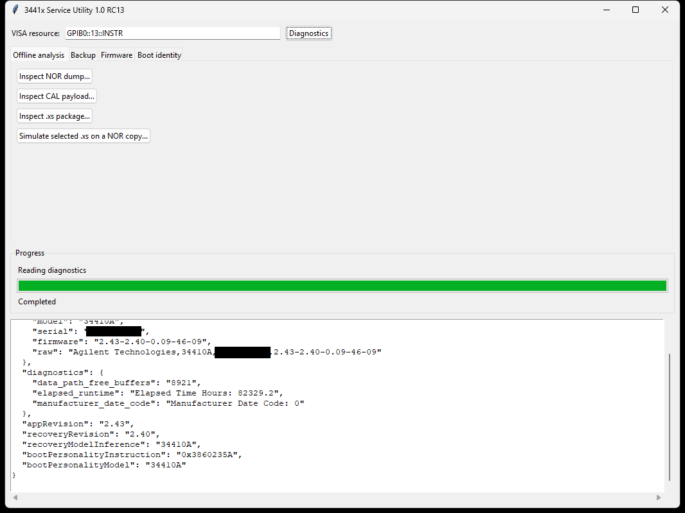
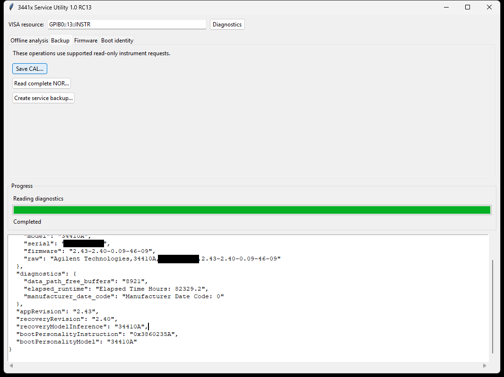
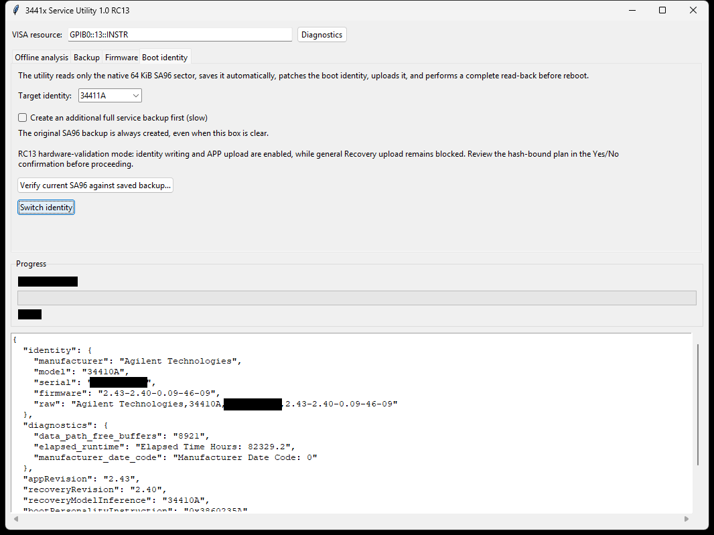
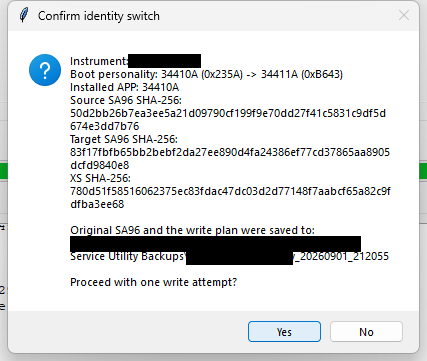
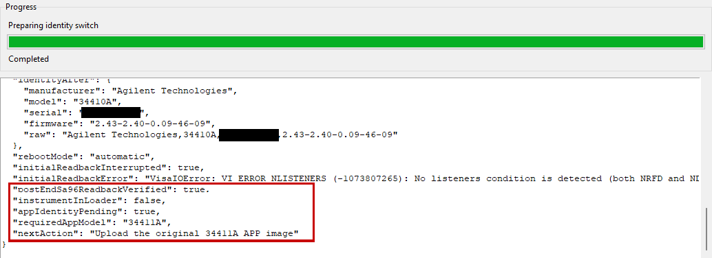
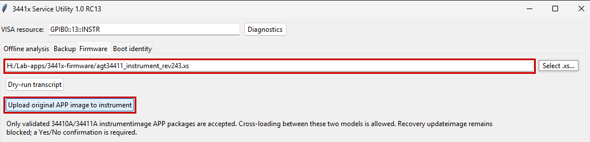
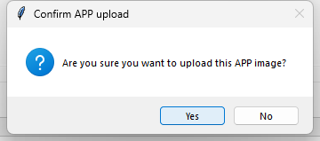
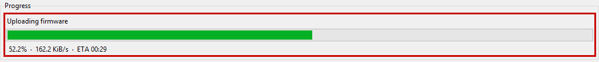
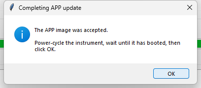
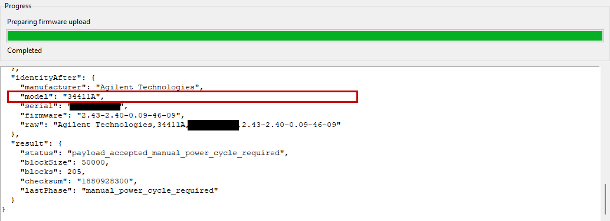

# Walkthrough: 34410A ↔ 34411A boot identity, step by step

An illustrated run of a complete conversion and its reversal on a real
instrument, using the GUI. Screenshots are from a 34410A, APP 2.43, Recovery
2.40, over GPIB. The instrument serial and host names are masked; the VISA
address is left visible because it is the thing the first step exists to
explain.

Every step here was performed on hardware. Where something is expected to look
alarming and is not a fault, this document says so — that is most of its value.

---

## 1. Before you start

### The instrument must already be healthy

- `*TST?` must return `+0`.
- It should be behaving normally on the functions you care about, not merely
  powering on.
- Fix anything marginal first — an intermittent front panel, a flaky interface,
  a suspect supply. Firmware work on a sick instrument turns one problem into
  two and makes it impossible to tell afterwards which one you are looking at.

### This can brick the instrument

It erases and rewrites the application image. A power cut, a pulled cable, a PC
crash or a host that gives up mid-transfer can leave the meter with no bootable
firmware. Most such states are recoverable through the loader — see
[Recovery](#8-recovery) — but recovery is not guaranteed, and the fallback is
removing the NOR flash and programming it externally.

A GPIB dump is a forensic record, **not** a restore path: there is no
write-back over the bus.

So: mains power you trust, nothing else contending for the interface, and no
plans for the next hour. If you are not prepared to lose the instrument, do not
start.

### You must obtain the firmware yourself

**This project ships no firmware, and none is licensed by it.** The packages are
Keysight's. Download them yourself from Keysight's site — the 34410A/34411A
firmware revision 2.43 packages, distributed as
`agt34410_instrument_rev243.zip` and `agt34411_instrument_rev243.zip`.

**Update the instrument to 2.43 first, using Keysight's own updater, before you
use this tool.** That is a separate job and your responsibility. It matters:

- Everything in this document was validated against **APP 2.43 / Recovery
  2.40**. Starting from a known revision is what makes a procedure transferable
  and a failure report meaningful.
- It is not theoretical. On EEVblog, `bsw_m` bricked a unit by applying work
  derived from firmware 2.35 to a unit that shipped with 2.40.

⚠️ **Updating the APP does not update the bootloader.** An `.xs` writes only
`0xFF800000`–`0xFFB52043`; the Recovery image lives at `0xFFE00000` and no
factory package contains a single record for it. So the Recovery revision
reflects when your instrument was built, not when it was last updated, and it
varies between units — 2.40 and 2.35 are both in the wild. Record both from
`*IDN?`: field 1 is the APP, field 2 the Recovery.

### Extract the packages

Each `.zip` contains, among other things, one `.xs` file. **That `.xs` is the
firmware** — Motorola S-records behind a plaintext header. Extract it and put it
somewhere you can find:

```
agt34410_instrument_rev243.xs
agt34411_instrument_rev243.xs
```

The `.zip` is only the delivery wrapper. The `FirmwareUpdateUtility.exe` inside
it is Keysight's own updater, which this tool replaces — you do not need it for
the procedure below, though it is worth keeping to hand.

**Record the SHA-256 of each `.xs` and check it before uploading.** A corrupted
package is the one input that turns a routine operation into a dead instrument.
And note the two filenames differ by a single character.

---

## 2. Connect, and confirm you have the right instrument



Clear the pre-filled `TCPIP0::192.168.0.10::inst0::INSTR` — it is a placeholder
in the source, not something detected — and enter the address of **your**
instrument. Then press **Diagnostics**.

If you have selected the instrument correctly, it reports its own state. That is
your confirmation before anything is written:

| Field | Meaning |
| :--- | :--- |
| `appRevision` | the application firmware — should be `2.43` |
| `recoveryRevision` | the bootloader — moves independently of the APP |
| `bootPersonalityInstruction` | the instruction that sets the identity |
| `bootPersonalityModel` | decoded from it: what the instrument boots as |

`0x3860235A` is a 34410A personality; `0x3860B643` is 34411A.

---

## 3. Back up



**Run Save CAL first, and keep running it.** It takes seconds, and it is the
cheapest integrity check available: capture it now, again between steps, and
compare the SHA-256. If the hash has not moved, calibration has not been
touched.

The three buttons are not alternatives — the third is a superset:

| Button | Reads | Time | Produces |
| :--- | :--- | ---: | :--- |
| Save CAL… | `CAL:DATA:ALL?` | seconds | `.bin` (4,934 B) + decoded `.json` |
| Read complete NOR… | all 8 MiB of flash | ~18 min | one `.bin`, resumable |
| Create service backup… | both, plus identity and diagnostics | ~20 min | everything below |

For the one-time backup, **use Create service backup and answer Yes to the NOR
prompt.** It adds `manifest.json` with a SHA-256 per file, which
`verify-backup` checks — the difference between having a backup and knowing it
is intact, which you would otherwise discover at the worst possible moment.

---

## 4. Which order? It depends on direction

The only combination that will not boot is a **34411A APP on a 34410A boot
personality**. The 34411A application validates the personality at startup; the
34410A application has no such check and runs on either.

So order the two operations to never create that pair:

| Direction | Order | Why |
| :--- | :--- | :--- |
| 34410A → 34411A | **identity, then APP** | the 34410A APP tolerates the new personality and keeps running |
| 34411A → 34410A | **APP, then identity** | the 34410A APP is in place before the 34410A personality arrives |

Follow that and the instrument boots normally at every stage. The rest of this
document walks the forward direction.

---

## 5. Switch the boot identity



Choose the target. Leave **Create an additional full service backup first**
clear if you already made one — the original SA96 sector is saved automatically
either way, as the tab says.



This is the last point of no return: **Yes** writes the sector, **No** cancels
with nothing written.

```
Boot personality: 34410A (0x235A) -> 34411A (0xB643)
Installed APP:    34410A
```

Those are two different things and they are allowed to disagree — every
conversion passes through a state where they do. Check the transition is the one
you intended, then proceed.

> **If you press No, the Progress panel will say "Operation failed".** Nothing
> failed and nothing was written; the GUI reports a cancel the same way it
> reports an error.

### The instrument reboots by itself here — that is normal

Writing the sector triggers a reboot. The utility does not ask for it and cannot
prevent it. The display will blank and the interface will drop briefly; the tool
waits and reconnects on its own. **Do not power-cycle, unplug, or intervene.**



```
"postEndSa96ReadbackVerified": true,
"instrumentInLoader":          false,
"appIdentityPending":          true,
"requiredAppModel":            "34411A",
"nextAction":                  "Upload the original 34411A APP image"
```

The sector was written and read back byte-for-byte, and the tool names the next
step itself.

Two lines above that you will see something alarming and harmless:

```
"initialReadbackInterrupted": true,
"initialReadbackError": "VisaIOError: VI_ERROR_NLISTENERS ... No listeners ..."
```

**That is the reboot, not a fault.** The instrument restarted while the sector
was being read back, so the bus dropped mid-read; the tool detected it,
reconnected and re-read.

### `*IDN?` will still report the old model

It reports `34410A` after a successful switch to 34411A, and it will keep doing
so until the APP is replaced. `*IDN?` is served by the application, which an
identity switch does not change — the 34410A image does not contain the string
`34411A` at all. **This is the expected result of a successful switch.**

---

## 6. Upload the matching APP image



Select the `.xs` matching the personality you just set, and check its SHA-256.
The two packages look identical in this window apart from one character in the
filename, and nothing else in the tool distinguishes them — so the filename and
the hash are your only confirmation of which direction you are about to send the
instrument.

**Dry-run transcript** prints the exact command sequence and writes nothing —
worth pressing once before your first real upload.



This dialog does not name the file, so satisfy yourself from the path field
before answering.



About 160 KiB/s over GPIB — roughly 70–90 seconds for 205 blocks. **Do not
interrupt.** No power cycle, nothing else on the bus. This is the one stretch
where a loss is genuinely unrecoverable.



⚠️ **This reboot is manual — the opposite of the identity switch.** Power-cycle
the instrument, wait until it has fully booted, *then* click OK. Clicking early
makes the utility query an instrument that is not up yet.

The tool deliberately does not send a reboot command here; the flash programming
completes across the power cycle, which is why it must be a real one.

"Accepted" means all blocks transferred and the instrument's own checksum
matched the package header. It does not yet mean the new firmware runs.

---

## 7. Verify



Press **Diagnostics** again and check the instrument's own account of itself:

| Check | Before | After |
| :--- | :--- | :--- |
| model | `34410A` | `34411A` |
| `bootPersonalityInstruction` | `0x3860235A` | `0x3860B643` |
| `SAMP:COUN? MAX` | `+50000` | `+1000000` |
| `TRIG:COUN? MAX` | `+5E+04` | `+1E+06` |
| `VOLT:DC:APER? MIN` | `9.98E-05` | ~`2E-05` |
| `*TST?` | `+0` | `+0` |

Then run **Save CAL** again and compare the hash with the one from step 3. It
should be identical.

Settings being accepted is not proof the hardware performs. If you want to
establish that, acquire at the higher rate rather than reading a limit back.

### What does not change

- **The serial number.** It lives in a separate EEPROM that neither operation
  touches.
- **Calibration.** It lives at `0xFFDC0010`, outside both write regions. Across
  a full conversion and reversal on the reference instrument the cal object was
  byte-identical throughout.

---

## 8. Recovery

**`PLEASE LOAD / 34410 FIRMWARE` on the display is not a brick.** It means the
installed application refused the boot personality it found. The loader is now
in charge, and the loader is the mode that accepts a firmware load.

An interrupted upload lands in the same place, reporting `loader_<model>` with
APP revision `0.00`.

From either state: select the `.xs` matching the current boot personality and
upload it, exactly as in step 6. The instrument answers `*IDN?` and the update
commands normally while the loader is running.

If the utility refuses to talk to an instrument in the loader, you are on a
build older than this change; use Keysight's own updater, which accepts loader
identities.

---

## 9. Going back

Same procedure, opposite order — **APP first, then identity** (see step 4). Load
the 34410A APP while the 34411A personality is still set; it will boot, because
that image does not check. Then switch the personality back.

Done that way the instrument boots normally at every stage and never enters the
refusal state.

The identity write is exactly reversible: the sector checksum is a plain 32-bit
word sum, so switching out and back lands on the original value. On the
reference instrument `verify-sa96` reported the sector byte-identical to the
pre-conversion original after a full cycle.
